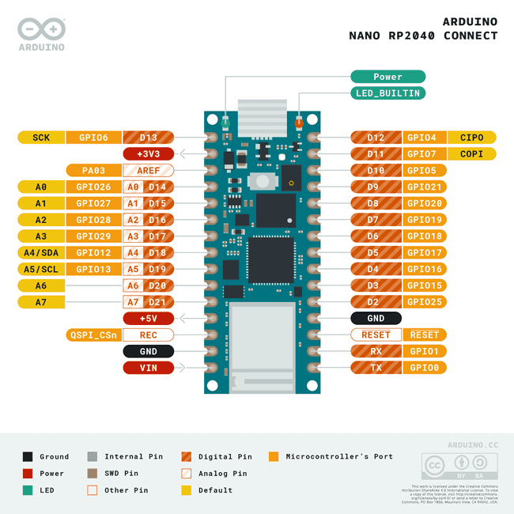
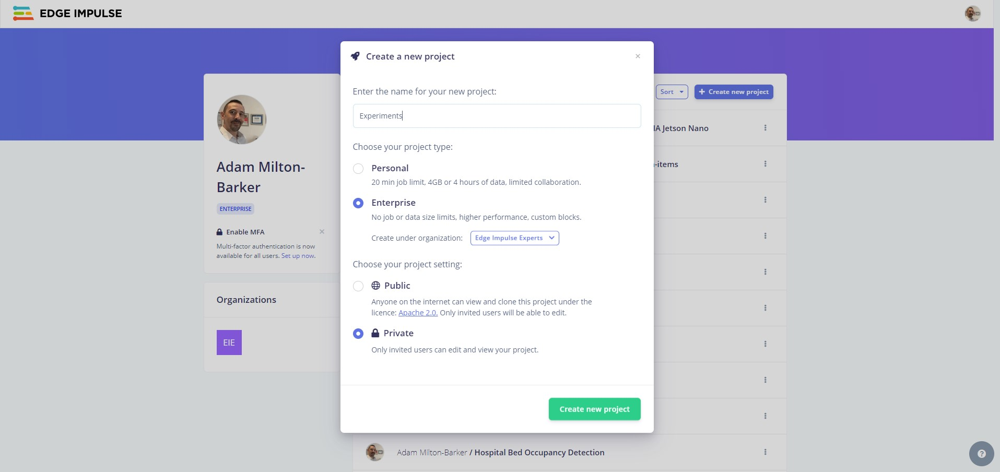
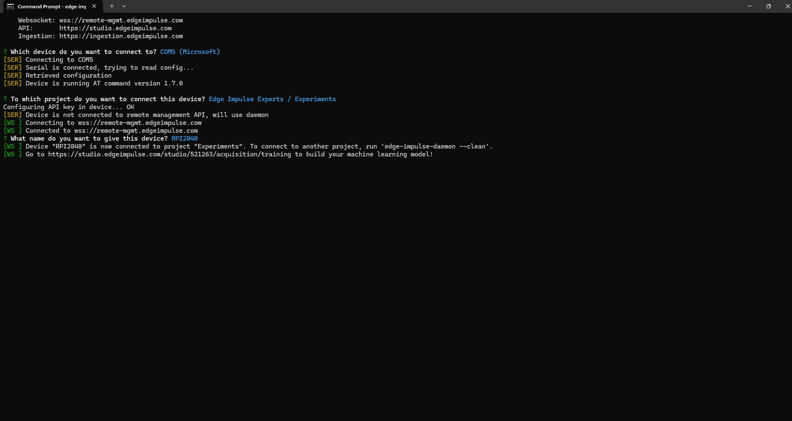
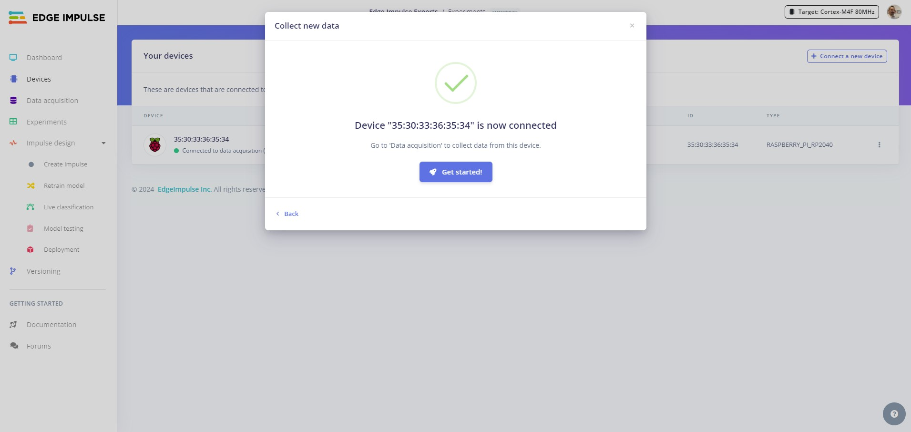

# Edge Impulse Experiments


# Introduction

Edge Impulse Experiments are a powerful new feature that allows users to run multiple active impulses within a single project. This enables seamless experimentation with various model configurations on the same dataset, offering a more efficient way to compare results.

The updated interface includes a new "Experiments" section, which centralizes impulse management and integrates the EON Tuner for enhanced trial handling. Along with API enhancements and streamlined processes, these changes significantly accelerate development and improve project organization, making it easier to transition from data collection to deployment.

This project provides a walk through of how to use experiments, along with source codes and a tutorial that will help you get started with Edge Impulse Experiments.

## Hardware

- Arduino Nano RPI2040 Connect [More Info](https://store.arduino.cc/products/arduino-nano-rp2040-connect)

## Platform

-  Edge Impulse [Visit](https://www.edgeimpulse.com)

## Software

- Edge Impulse CLI [Download](https://docs.edgeimpulse.com/docs/edge-impulse-cli/cli-installation)
- Arduino CLI [Download](https://arduino.github.io/arduino-cli/latest/)
- Arduino IDE 2.2.1 [Download](https://www.arduino.cc/en/software)

# Getting Started

## Arduino Nano RPI2040 Connect


The Arduino Nano RP2040 Connect is a highly versatile development board, bringing the power of the Raspberry Pi RP2040 microcontroller to the compact Nano form factor. Equipped with dual-core 32-bit Arm Cortex-M0+ processors, it enables seamless creation of IoT projects with built-in Wi-Fi and Bluetooth support via the U-blox Nina W102 module. The board includes an accelerometer, gyroscope, RGB LED, and omnidirectional microphone, making it ideal for real-time data collection and embedded AI applications.



The Nano RP2040 Connect is fully compatible with the Arduino Cloud platform, allowing users to rapidly prototype IoT solutions. It also supports MicroPython for those who prefer Python for programming. With a clock speed of 133 MHz, the board is well-suited for machine learning tasks, offering support for frameworks like TinyML and TensorFlow Lite. Additionally, its 6-axis IMU and temperature sensor expand the board’s capability for advanced real-world applications.

To begin working with the Edge Impulse platform and the Nano RPI2040 Connect, follow [this tutorial](https://docs.edgeimpulse.com/docs/edge-ai-hardware/mcu/raspberry-pi-rp2040) to connect your device.

# Edge Impulse

## Create Edge Impulse Project



Now it's time to create your Edge Impulse project. Head over to [Edge Impulse](https://studio.edgeimpulse.com/), log in, and create your new project.

Edge Impulse offers experiments to all users, with the community tier allowing up to three simultaneous experiments. Users on the Professional Plan and Enterprise tiers enjoy unlimited access to experiments. You can explore all the platform’s advanced features by signing up for an [Enterprise Trial](https://studio.edgeimpulse.com/trial-signup).


Once your project is created, you will see the project dashboard which will show you new additions to the platform.

## Connect Your Device

Next you need to connect your device to the Edge Impulse platform. Ensuring you have the Nano connected to your computer, open commandline or terminal and use the following command:

```bash
edge-impulse-daemon
```



You will be prompted for your Edge Impulse login details to proceed. Once authenticated you will need to choose the COM port that your device is connected to, and then select the Edge Impulse project you want to connect your device to.



If you now head over to your project and go the `Devices` tab, you will see your device is now connected.
